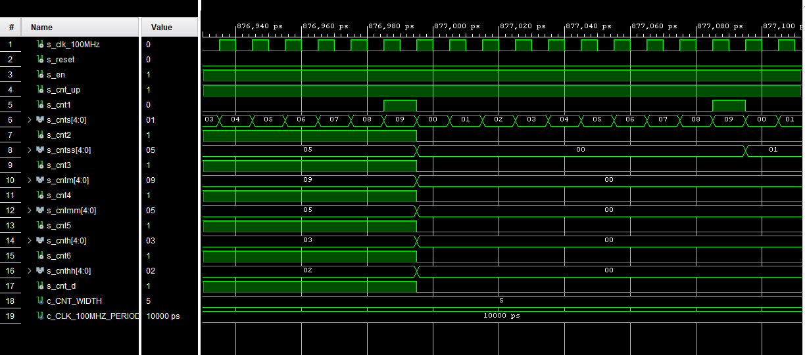

# DIGITAL CLOCK

### Team members

* Member 1 Šimon Buchta
* Member 2 Michal Český
* Member 3 Raul Gomez Ibanez

### Table of contents

* [Project objectives](#objectives)
* [Hardware description](#hardware)
* [VHDL modules description and simulations](#modules)
* [TOP module description and simulations](#top)
* [Video](#video)
* [References](#references)

<a name="objectives"></a>

## Project objectives

Tento repositář vznikl na základě předmětu Digitální elektrotechnika 1 na vysoké škole VUT FEKT.
Zadáním bylo vytvořit digitální hodiny v jazyce vhdl. Hodiny by měli mít základní hodinový strojek pro počítání sekund, minut a následně hodin, možnost nastavení času a na závěr nastavení budíku na určitý čas kde se poté rozsvítí LED dioda. Čas se bude zobrazovat na šesti segmentových displejích.
Toto implementujeme pomocí programu Vivadeo na desku Nexys A7-50T.

<a name="hardware"></a>

## Hardware description

Deska Nexys A7 je kompletní platforma pro vývoj digitálních obvodů připravená k použití, založená na nejnovějším Artix-7™ Field Programmable Gate Array (FPGA) od Xilinx®. Díky velkému, vysokokapacitnímu FPGA, velkorysým externím pamětem a sbírce USB, Ethernet a dalších portů může Nexys A7 hostit návrhy od úvodních kombinačních obvodů až po výkonné vestavěné procesory.


V našem případě budeme pouze používat segmentové displeje, tlačítka a spínače.

#### Display
Deska Nexys A7 obsahuje dva čtyřmístné sedmisegmentové LED displeje se společnou anodou, nakonfigurované tak, aby se chovaly jako jeden osmimístný displej. V našem případě budeme využívat oba čtyřsegmentové displeje ale ten druhý pouze z půlky. Jeden sedmisegmentový displej se skládá ze sedmi segmentů, pokud budou svítit všechny segmenty dostaneme číslo 8. K tomu, aby každý displej mohl svítit samostatně je zapotřebí mít oddělené katody. Jeho schéma je vidět na obrázku.


#### Tlačítka a Spínače

Tato deska disponuje 16 spínačia a tlačítky. Tyto spínače a tlačítka jsou k desce připojeny přes odpory aby nemohlo vzniknout poškození desky. Tlačítka jsou dizainované na změně výkonu. Při stisknutí generují mnohem větší výkon nežpři normáloném stavu. 
Jak josuzapojeny tlačítka, spínače, LED diody, segmentové displeje a následně RGB LED diody zobrazuje toto schema.


#### Constraints File
Tento soubor slouží k správnému přiřazení pinů na desce.

```shell
## Clock signal
set_property -dict { PACKAGE_PIN E3    IOSTANDARD LVCMOS33 } [get_ports { CLK100MHZ }]; #IO_L12P_T1_MRCC_35 Sch=clk100mhz
create_clock -add -name sys_clk_pin -period 10.00 -waveform {0 5} [get_ports {CLK100MHZ}];

##Switches
set_property -dict { PACKAGE_PIN J15   IOSTANDARD LVCMOS33 } [get_ports { SW[0] }]; #IO_L24N_T3_RS0_15 Sch=sw[0]
set_property -dict { PACKAGE_PIN L16   IOSTANDARD LVCMOS33 } [get_ports { SW[1] }]; #IO_L3N_T0_DQS_EMCCLK_14 Sch=sw[1]
set_property -dict { PACKAGE_PIN M13   IOSTANDARD LVCMOS33 } [get_ports { SW[2] }]; #IO_L6N_T0_D08_VREF_14 Sch=sw[2]
set_property -dict { PACKAGE_PIN R15   IOSTANDARD LVCMOS33 } [get_ports { SW[3] }]; #IO_L13N_T2_MRCC_14 Sch=sw[3]

##7 segment display
set_property -dict { PACKAGE_PIN T10   IOSTANDARD LVCMOS33 } [get_ports { CA }]; #IO_L24N_T3_A00_D16_14 Sch=ca
set_property -dict { PACKAGE_PIN R10   IOSTANDARD LVCMOS33 } [get_ports { CB }]; #IO_25_14 Sch=cb
set_property -dict { PACKAGE_PIN K16   IOSTANDARD LVCMOS33 } [get_ports { CC }]; #IO_25_15 Sch=cc
set_property -dict { PACKAGE_PIN K13   IOSTANDARD LVCMOS33 } [get_ports { CD }]; #IO_L17P_T2_A26_15 Sch=cd
set_property -dict { PACKAGE_PIN P15   IOSTANDARD LVCMOS33 } [get_ports { CE }]; #IO_L13P_T2_MRCC_14 Sch=ce
set_property -dict { PACKAGE_PIN T11   IOSTANDARD LVCMOS33 } [get_ports { CF }]; #IO_L19P_T3_A10_D26_14 Sch=cf
set_property -dict { PACKAGE_PIN L18   IOSTANDARD LVCMOS33 } [get_ports { CG }]; #IO_L4P_T0_D04_14 Sch=cg
set_property -dict { PACKAGE_PIN H15   IOSTANDARD LVCMOS33 } [get_ports { DP }]; #IO_L19N_T3_A21_VREF_15 Sch=dp
set_property -dict { PACKAGE_PIN J17   IOSTANDARD LVCMOS33 } [get_ports { AN[0] }]; #IO_L23P_T3_FOE_B_15 Sch=an[0]
set_property -dict { PACKAGE_PIN J18   IOSTANDARD LVCMOS33 } [get_ports { AN[1] }]; #IO_L23N_T3_FWE_B_15 Sch=an[1]
set_property -dict { PACKAGE_PIN T9    IOSTANDARD LVCMOS33 } [get_ports { AN[2] }]; #IO_L24P_T3_A01_D17_14 Sch=an[2]
set_property -dict { PACKAGE_PIN J14   IOSTANDARD LVCMOS33 } [get_ports { AN[3] }]; #IO_L19P_T3_A22_15 Sch=an[3]
set_property -dict { PACKAGE_PIN P14   IOSTANDARD LVCMOS33 } [get_ports { AN[4] }]; #IO_L8N_T1_D12_14 Sch=an[4]
set_property -dict { PACKAGE_PIN T14   IOSTANDARD LVCMOS33 } [get_ports { AN[5] }]; #IO_L14P_T2_SRCC_14 Sch=an[5]
set_property -dict { PACKAGE_PIN K2    IOSTANDARD LVCMOS33 } [get_ports { AN[6] }]; #IO_L23P_T3_35 Sch=an[6]
set_property -dict { PACKAGE_PIN U13   IOSTANDARD LVCMOS33 } [get_ports { AN[7] }]; #IO_L23N_T3_A02_D18_14 Sch=an[7]

##Buttons
set_property -dict { PACKAGE_PIN N17   IOSTANDARD LVCMOS33 } [get_ports { BTNC }]; #IO_L9P_T1_DQS_14 Sch=btnc
set_property -dict { PACKAGE_PIN M18   IOSTANDARD LVCMOS33 } [get_ports { BTNU }]; #IO_L4N_T0_D05_14 Sch=btnu
```

<a name="modules"></a>

## VHDL modules description and simulations

#### Clock_enable
Tento modul slouží ke generování hodinového signálu. Tento modul jsme následně využili u cnt_up_down.
```vhdl
library ieee;               -- Standard library
use ieee.std_logic_1164.all;-- Package for data types and logic operations
use ieee.numeric_std.all;   -- Package for arithmetic operations

entity clock_enable is
    generic(
        g_MAX : natural := 400000  -- Number of clk pulses to
                               -- generate one enable signal
                               -- period
    );  -- Note that there IS a semicolon between generic 
        -- and port sections
    port(
        clk   : in  std_logic; -- Main clock
        reset : in  std_logic; -- Synchronous reset
        ce_o  : out std_logic  -- Clock enable pulse signal
    );
end entity clock_enable;

architecture Behavioral of clock_enable is

    -- Local counter
    signal s_cnt_local : natural;

begin
    p_clk_ena : process(clk)
    begin
        if rising_edge(clk) then    -- Synchronous process

            if (reset = '1') then   -- High active reset
                s_cnt_local <= 0;   -- Clear local counter
                ce_o        <= '0'; -- Set output to low

            -- Test number of clock periods
            elsif (s_cnt_local >= (g_MAX - 1)) then
                s_cnt_local <= 0;   -- Clear local counter
                ce_o        <= '1'; -- Generate clock enable pulse

            else
                s_cnt_local <= s_cnt_local + 1;
                ce_o        <= '0';
            end if;
        end if;
    end process p_clk_ena;

end architecture Behavioral;
```

#### cnt_up_down 0
Modul slouží k jednotlivému počítání setin vteřin. Podmínka značí že pokud čítač dosáhne hodnoty 9 vyresetuje se a začne počítat zase od 0.
```vhdl
library ieee;
use ieee.std_logic_1164.all;
use ieee.numeric_std.all;

entity cnt_up_down is
    generic(
        g_CNT_WIDTH : natural := 4 -- Number of bits for counter
    );
    port(
        clk      : in  std_logic;  -- Main clock
        reset    : in  std_logic;  -- Synchronous reset
        en_i     : in  std_logic;  -- Enable input
        cnt_up_i : in  std_logic;  -- Direction of the counter
        cnt_os   : out std_logic_vector(g_CNT_WIDTH - 1 downto 0);
        cnt_o    : out std_logic
    );
end entity cnt_up_down;

architecture behavioral of cnt_up_down is

    -- Local counter
    signal s_cnt_local : unsigned(g_CNT_WIDTH - 1 downto 0);
begin
    p_cnt_up_down : process(clk)
    begin
        
        if rising_edge(clk) then
        
            if (reset = '1') then   -- Synchronous reset
                s_cnt_local <= (others => '0'); -- Clear all bits

            elsif (en_i = '1') then -- Test if counter is enabled
                  s_cnt_local <= (others => '0');
                
                if (cnt_up_i = '1') then
                    
                    
                
                    if (s_cnt_local(0) = '0') and (s_cnt_local(1) = '0' ) and (s_cnt_local(2) = '0' ) and (s_cnt_local(3) = '1' ) then
                        s_cnt_local <= s_cnt_local + 1;
                        cnt_o <= '1';
                    elsif (s_cnt_local(0) = '1') and (s_cnt_local(1) = '0' ) and (s_cnt_local(2) = '0' ) and (s_cnt_local(3) = '1' ) then
                        s_cnt_local <= (others => '0'); -- Clear all bits
                        cnt_o <= '0';
                    else
                        s_cnt_local <= s_cnt_local + 1;
                        cnt_o <= '0';  
                    end if;      
                else             
                    s_cnt_local <= s_cnt_local ;
                end if;
                
            end if;
            
            
            
        end if;
    end process p_cnt_up_down;

    -- Output must be retyped from "unsigned" to "std_logic_vector"
    cnt_os <= std_logic_vector(s_cnt_local);
    
end architecture behavioral;
```


#### cnt_up_down 1
Modul slouží k jednotlivému počítání desítek vteřin. Podmínka značí že pokud čítač cnt_up_down dosáhne hodnoty 9 tak začne počítat. Tato podmínka platí do té doby než čítač dosáhne hodnoty 6. Poté se vyresetuje.
```vhdl
library ieee;
use ieee.std_logic_1164.all;
use ieee.numeric_std.all;

------------------------------------------------------------
-- Entity declaration for n-bit counter
------------------------------------------------------------
entity cnt_up_down_1 is
    generic(
        g_CNT_WIDTH : natural := 4 -- Number of bits for counter
    );
    port(
        clk      : in  std_logic;  -- Main clock
        reset    : in  std_logic;  -- Synchronous reset
        en_i     : in  std_logic;  -- Enable input
        cnt_i   : in  std_logic;  -- Direction of the counter
        cnt_oss  : out std_logic_vector(g_CNT_WIDTH - 1 downto 0);
        cnt_o   : out std_logic
    );
end entity cnt_up_down_1;

------------------------------------------------------------
-- Architecture body for n-bit counter
------------------------------------------------------------
architecture behavioral of cnt_up_down_1 is

    -- Local counter
    signal s_cnt_local : unsigned(g_CNT_WIDTH - 1 downto 0);

begin
    --------------------------------------------------------
    -- p_cnt_up_down:
    -- Clocked process with synchronous reset which implements
    -- n-bit up/down counter.
    --------------------------------------------------------
    p_cnt_up_down : process(clk)
    begin
        if rising_edge(clk) then
        
            if (reset = '1') then   -- Synchronous reset
                s_cnt_local <= (others => '0'); -- Clear all bits

            elsif (en_i = '1') then -- Test if counter is enabled
                  s_cnt_local <= (others => '0');
                
                if (cnt_i = '1') then
                
                    if (s_cnt_local(0) = '0') and (s_cnt_local(1) = '0' ) and (s_cnt_local(2) = '1' ) and (s_cnt_local(3) = '0' ) then
                        s_cnt_local <= s_cnt_local + 1;
                        cnt_o <= '1';
                    elsif (s_cnt_local(0) = '1') and (s_cnt_local(1) = '0' ) and (s_cnt_local(2) = '1' ) and (s_cnt_local(3) = '0' ) then
                        s_cnt_local <= (others => '0'); -- Clear all bits
                        cnt_o <= '0';
                    else
                        s_cnt_local <= s_cnt_local + 1;
                        cnt_o <= '0';  
                    end if;   
                
             else             
                    s_cnt_local <= s_cnt_local ;
                
                
                 end if;
            end if;
            
            
        end if;
    end process p_cnt_up_down;

    -- Output must be retyped from "unsigned" to "std_logic_vector"
    cnt_oss <= std_logic_vector(s_cnt_local);

end architecture behavioral;

<a name="top"></a>

## TOP module description and simulations

Write your text here.

<a name="video"></a>

## Video

Write your text here

<a name="references"></a>

## References

1. Nexis A7 board popis: digilentinc.com [online]. [Arty A7](https://reference.digilentinc.com/reference/programmable-logic/arty-a7/reference-manual) 
