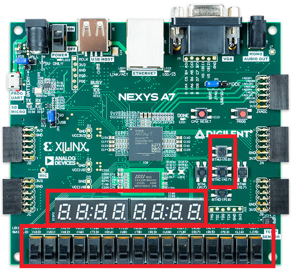
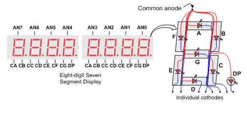

# DIGITAL CLOCK

### Team members

* Member 1 Šimon Buchta
* Member 2 Michal Český
* Member 3 Raul Gomez Ibanez

### Table of contents

* [Project objectives](#objectives)
* [Hardware description](#hardware)
* [VHDL modules description and simulations](#modules)
* [TOP module description and simulations](#top)
* [Video](#video)
* [References](#references)

<a name="objectives"></a>

## Project objectives

Tento repositář vznikl na základě předmětu Digitální elektrotechnika 1 na vysoké škole VUT FEKT.
Zadáním bylo vytvořit digitální hodiny v jazyce vhdl. Hodiny by měli mít základní hodinový strojek pro počítání sekund, minut a následně hodin, možnost nastavení času a na závěr nastavení budíku na určitý čas kde se poté rozsvítí LED dioda. Čas se bude zobrazovat na šesti segmentových displejích.
Toto implementujeme pomocí programu Vivadeo na desku Nexys A7-50T.

<a name="hardware"></a>

## Hardware description

Deska Nexys A7 je kompletní platforma pro vývoj digitálních obvodů připravená k použití, založená na nejnovějším Artix-7™ Field Programmable Gate Array (FPGA) od Xilinx®. Díky velkému, vysokokapacitnímu FPGA, velkorysým externím pamětem a sbírce USB, Ethernet a dalších portů může Nexys A7 hostit návrhy od úvodních kombinačních obvodů až po výkonné vestavěné procesory.



V našem případě budeme pouze používat segmentové displeje, tlačítka a spínače.

#### Display
Deska Nexys A7 obsahuje dva čtyřmístné sedmisegmentové LED displeje se společnou anodou, nakonfigurované tak, aby se chovaly jako jeden osmimístný displej. V našem případě budeme využívat oba čtyřsegmentové displeje ale ten druhý pouze z půlky. Jeden sedmisegmentový displej se skládá ze sedmi segmentů, pokud budou svítit všechny segmenty dostaneme číslo 8. K tomu, aby každý displej mohl svítit samostatně je zapotřebí mít oddělené katody. Jeho schéma je vidět na obrázku.



#### Tlačítka a Spínače

Tato deska disponuje 16 spínačia a tlačítky. Tyto spínače a tlačítka jsou k desce připojeny přes odpory aby nemohlo vzniknout poškození desky. Tlačítka jsou dizainované na změně výkonu. Při stisknutí generují mnohem větší výkon nežpři normáloném stavu. 
Jak josuzapojeny tlačítka, spínače, LED diody, segmentové displeje a následně RGB LED diody zobrazuje toto schema.


#### Constraints File
Tento soubor slouží k správnému přiřazení pinů na desce.

```shell
##Switches
set_property -dict { PACKAGE_PIN J15   IOSTANDARD LVCMOS33 } [get_ports { a_i[0] }]; #IO_L24N_T3_RS0_15 Sch=sw[0]

```

<a name="modules"></a>

## VHDL modules description and simulations

Write your text here.

<a name="top"></a>

## TOP module description and simulations

Write your text here.

<a name="video"></a>

## Video

Write your text here

<a name="references"></a>

## References

1. Nexis A7 board popis: digilentinc.com [online]. [Arty A7](https://reference.digilentinc.com/reference/programmable-logic/arty-a7/reference-manual) 
